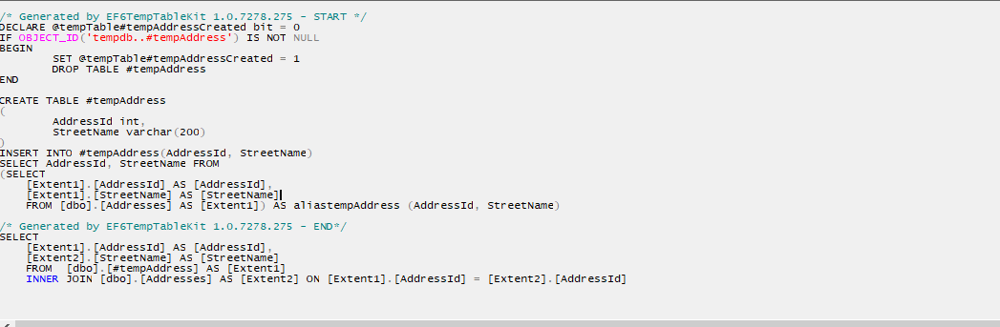

# EF6TempTableKit - one file example

Very basic simple one file Ef6TempTableKit demo. 

Open your Visual Studio and press F5 is all you need to do.

Behind the scene you will get
1. DB on your local SQL Server
2. Demo data

Generated code should be like

